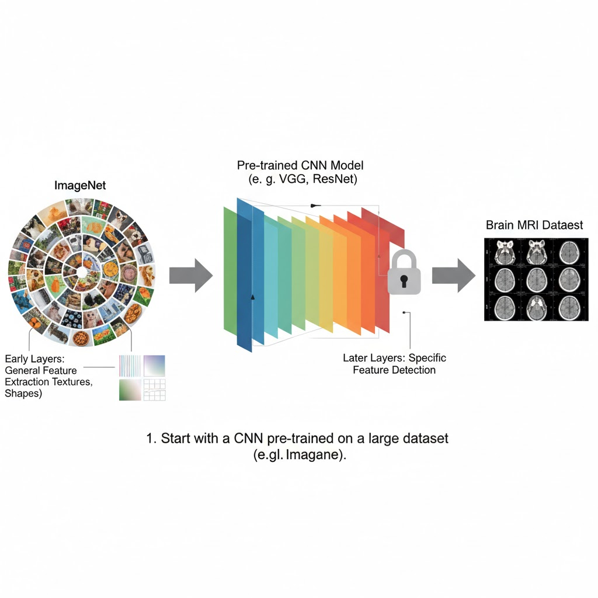

# 🧠 Medical Image Classification with CNN

This project demonstrates a deep learning solution for the classification of medical images, specifically focusing on a **Brain Dataset**. Built using **TensorFlow** and **Keras**, the model employs a custom Convolutional Neural Network (CNN) architecture optimized for high performance and robustness.

## 🚀 The Approach

The solution is centered around a custom-built CNN designed to effectively extract features and learn patterns from complex medical imaging data.

### 1. Data Augmentation
To combat overfitting and ensure the model generalizes well to unseen data, extensive data augmentation is applied during the training phase.
* **Transformations applied:** Rotations, width/height shifts, zooms, shearing, and horizontal flips.
* **Benefit:** This artificially expands the dataset, forcing the model to learn invariant features rather than memorizing specific images.

### 2. Model Architecture
The core is a sequential CNN architecture designed for computational efficiency and feature extraction.
* **Convolutional Blocks:** Multiple blocks containing Conv2D layers followed immediately by **Batch Normalization** and **Max Pooling**.
* **Feature Extraction:** This hierarchical structure allows the model to progressively learn low-level edges to high-level complex brain features.
* **Regularization:** The network concludes with fully connected Dense layers and a **Dropout** layer to further prevent overfitting.

### 3. Transfer Learning

While this project outlines a custom CNN, a common and highly effective approach in medical imaging (especially with limited datasets) is **Transfer Learning**. This involves leveraging knowledge from a model pre-trained on a very large, general dataset (like ImageNet) and adapting it to our specific task.

Here's a conceptual overview of how transfer learning works:

**Pre-trained Model (Feature Extractor):**

### 3. Optimization & Training Strategy
The training process is fine-tuned using the **Adam** optimizer with a `categorical_crossentropy` loss function. We utilize advanced callbacks to ensure optimal convergence:
* **`ReduceLROnPlateau`:** Automatically decreases the learning rate when the validation loss stops improving, allowing the model to settle into a better local minimum.
* **`ModelCheckpoint`:** Saves weights *only* when validation loss improves, ensuring the final saved model is the absolute best version (preventing degradation in later epochs).

---

## 📊 Evaluation & Results

The model was evaluated on a dedicated validation set to provide a reliable measure of its real-world classification ability.

### Key Metrics

| Metric | Score |
| :--- | :--- |
| **Validation Accuracy** | **85.95%** |
| **Best Validation Loss** | **0.31896** |

---

### 🛠️ Tech Stack
* **Python**
* **TensorFlow / Keras**
* **NumPy / Pandas** (for data manipulation)
* **Matplotlib / Seaborn** (for visualization)

## ✨ Contributors

Thanks to these wonderful people who contributed to this project:

| Name | Role |  
|---|---|
| **Krishna Thawani** | Trained Model on Chest X-rays | 
| **Keshav Mittal** | Trained Model on Brain MRIs |
